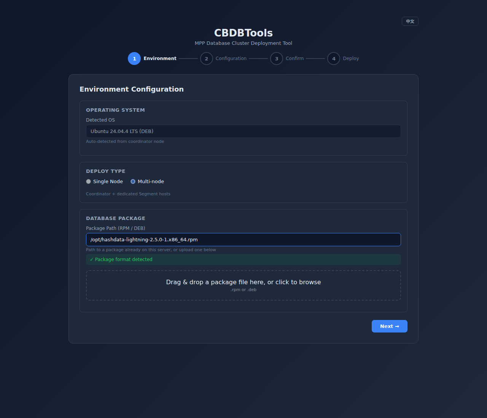
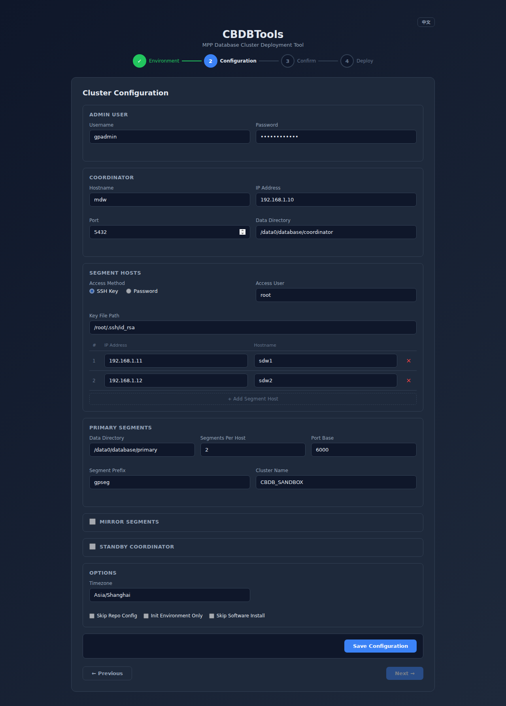
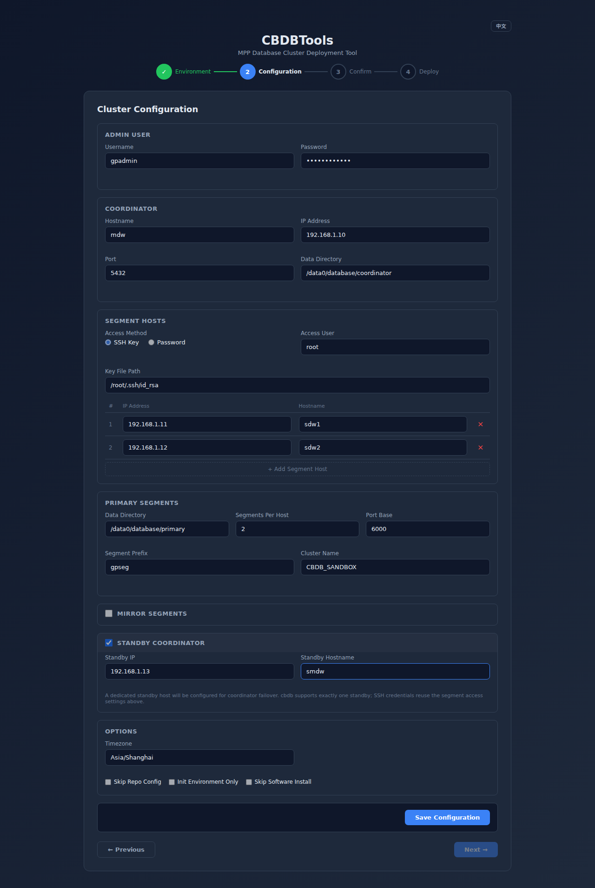
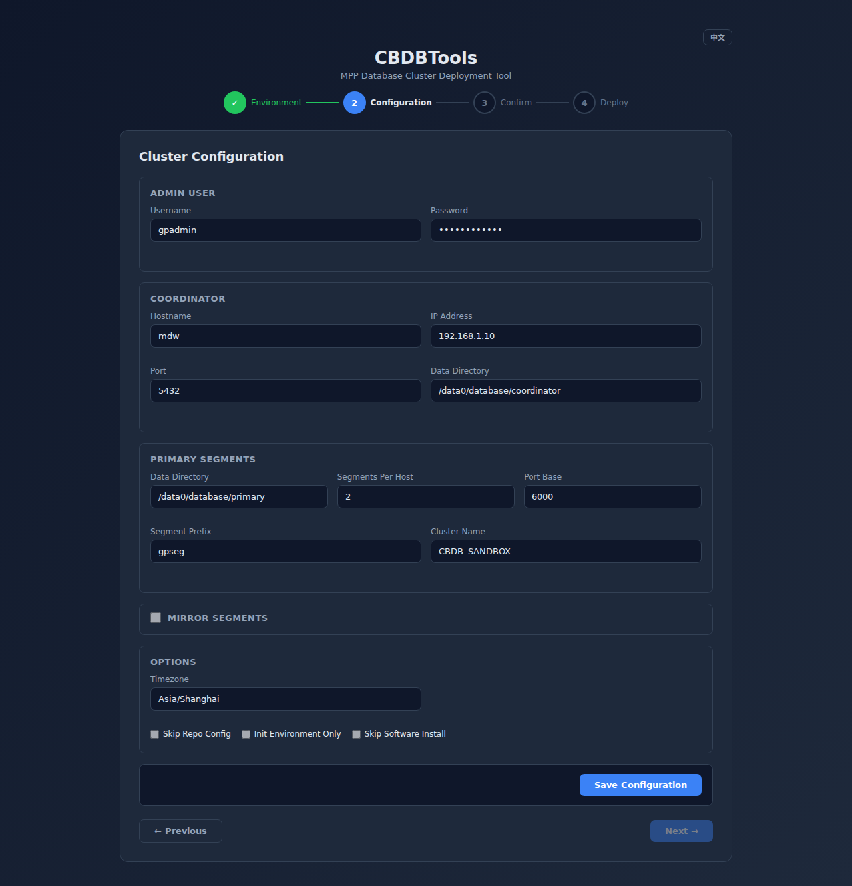
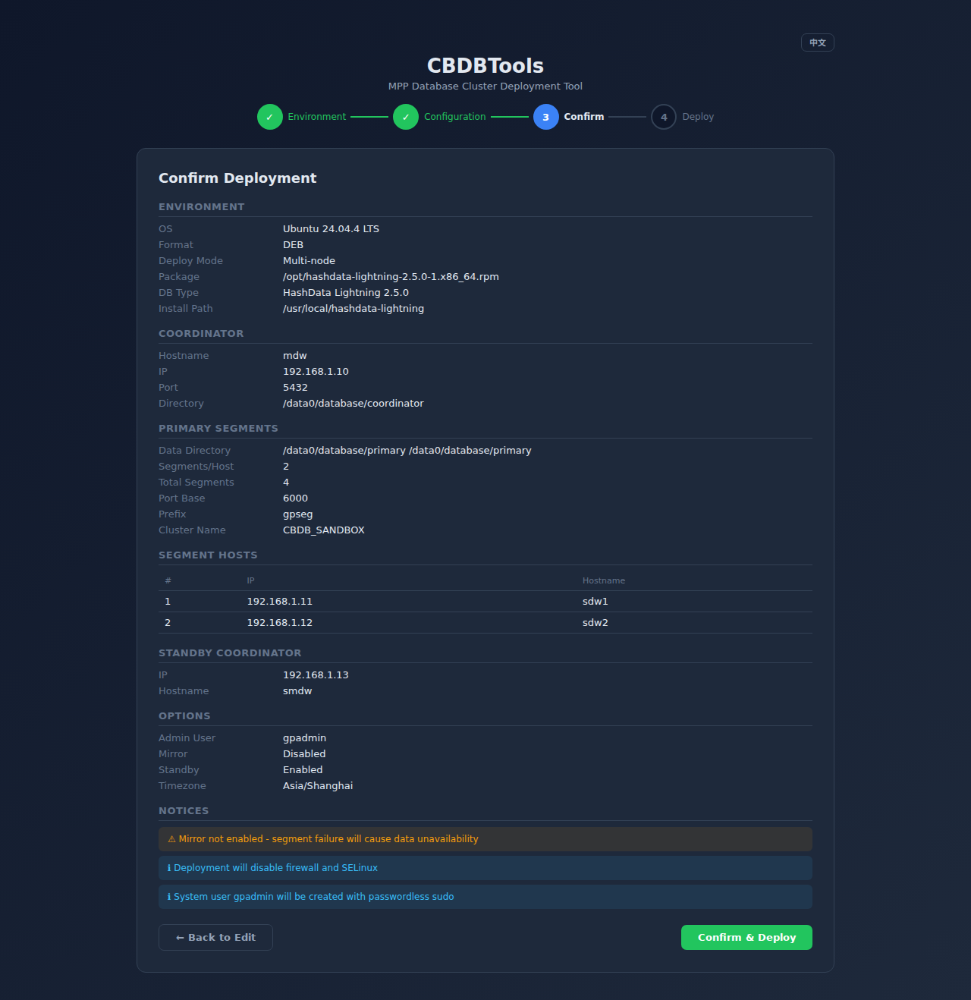
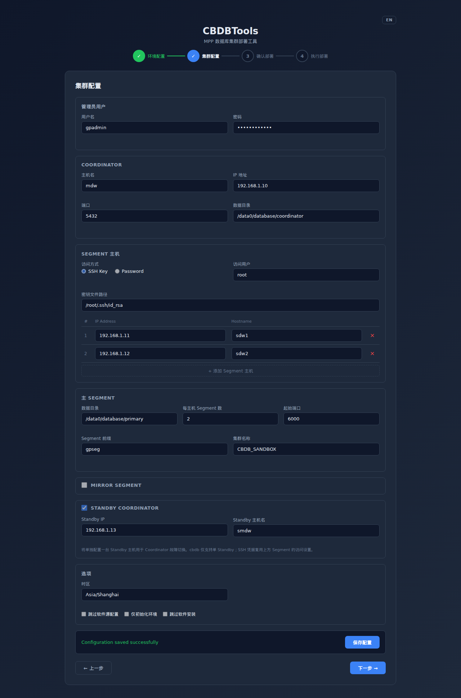

# CBDBTools

[English](README.md)

CBDBTools 是一套 MPP 数据库集群自动化部署工具，支持 Cloudberry、Greenplum、HashData Lightning 和 SynxDB。

提供两种部署方式：
1. **Web UI 部署** - 4 步向导式界面引导部署
2. **命令行部署** - 传统 Shell 脚本方式

两种方式都在 **Coordinator 节点**上运行，调用同一套底层部署脚本。

---

## 目录

- [仓库结构](#仓库结构)
- [支持平台](#支持平台)
- [前置条件](#前置条件)
- [部署方式](#部署方式)
  - [Web UI 部署](#web-ui-部署)
  - [命令行部署](#命令行部署)
- [系统调优](#系统调优)
- [功能特性](#功能特性)
- [脚本概览](#脚本概览)
- [实用工具](#实用工具)
- [常见问题](#常见问题)

---

## 仓库结构

```
.
├── run.sh                       # CLI 入口
├── deploycluster.sh             # 核心编排脚本
├── deploycluster_parameter.sh   # 中央配置文件
├── init_env.sh                  # Coordinator 环境初始化
├── init_env_segment.sh          # Segment 节点环境初始化
├── init_cluster.sh              # 数据库集群初始化
├── common.sh                    # 共享函数库
├── multissh.sh                  # 并行 SSH 命令执行
├── multiscp.sh                  # 并行文件分发
├── segmenthosts.conf            # 主机/IP 配置
├── mirrorlessfailover.sh        # 无 Mirror 场景故障转移工具
├── cluster_deploy_web.py        # Flask Web 应用
├── start_web.sh                 # Web UI 启动脚本
├── wsgi.py                      # WSGI 入口
├── templates/
│   └── index.html               # Web UI（单页应用）
├── test_web.py                  # Web 应用测试
└── sshpass-1.10.tar.gz          # sshpass 源码包（离线安装用）
```

---

## 支持平台

### 操作系统

| 操作系统 | 版本 | 包格式 |
|----------|------|--------|
| CentOS / RHEL | 7, 8, 9 | RPM |
| Rocky Linux | 8, 9 | RPM |
| Oracle Linux | 8 | RPM |
| Ubuntu | 20.04, 22.04, 24.04 | DEB |

### 数据库

| 数据库 | 版本 | 安装路径 |
|--------|------|----------|
| Cloudberry DB | 1.x, 2.x | `/usr/local/cloudberry-db` |
| Greenplum | 5.x, 6.x, 7.x | `/usr/local/greenplum-db` |
| HashData Lightning | 1.x, 2.x | `/usr/local/hashdata-lightning` |
| SynxDB | 1.x, 2.x, 4.x | `/usr/local/synxdb` 或 `/usr/local/synxdb4` |

---

## 前置条件

1. **环境要求：**
   - 工具必须在 **Coordinator** 服务器上执行
   - 需要 `root` 用户权限（支持密码和密钥认证）
   - 磁盘建议使用 XFS 文件系统，挂载选项 `noatime,inode64`
   - 充足的内存和 CPU（参考数据库官方文档）

2. **依赖（自动安装）：**
   - `sshpass`（通过包管理器或编译内置源码包）
   - `python3`, `pip`, `flask`, `gunicorn`（Web UI 需要）
   - `chrony` 或 `ntpd`（时间同步）

3. **网络：**
   - 所有集群节点必须可从 Coordinator 访问
   - Web UI 需要开放 5000 端口（部署过程中会自动禁用防火墙）

---

## 部署方式

### Web UI 部署

在 Coordinator 上启动 Web 服务：

```bash
bash start_web.sh
```

> **注意：** 请始终使用 `bash`（而非 `sh`）运行脚本。Ubuntu 上 `/bin/sh` 是 dash，不支持脚本中使用的 bash 特性。

然后在浏览器中打开 `http://<coordinator-ip>:5000`。

Web UI 采用 4 步向导模式。

#### 第 1 步 — 环境配置

选择操作系统（自动检测）、部署模式（单机/多机）、数据库安装包。可填写服务器上已有的安装包路径，也可**直接从浏览器拖拽上传**(带实时进度)。安装包校验通过后点击**下一步**。



#### 第 2 步 — 集群配置

填写管理员用户、Coordinator 信息、Segment 主机(仅多机模式)、数据目录、Segment SSH 访问方式。表单底部的 **Mirror Segments** 与 **Standby Coordinator** 是两个可选开关。



勾选 **Standby Coordinator** 后会展开 IP + 主机名输入框。cbdb **仅支持一个** Standby Coordinator；Standby 主机复用 Segment 的 SSH 凭据,**不需要第二套凭据**。如果填写的 Standby IP 与 Coordinator 或任意 Segment 冲突,表单会拒绝保存。



**Standby Coordinator** 开关仅在多机模式下出现。第 1 步切回 **Single Node** 时,该区段会自动隐藏并强制取消勾选(单机模式没有第二台机器承载 standby,`gpinitstandby` 会失败)。



点击**保存配置**持久化,然后点击**下一步**。

#### 第 3 步 — 确认部署

预览完整部署配置摘要。启用 Standby 时会展示 **Standby Coordinator** 段(IP + 主机名);未启用 Mirror / Standby 时会显示警告。



点击 **Confirm & Deploy** 启动部署。

#### 第 4 步 — 执行部署

实时日志流输出,带阶段进度指示器。成功后显示连接信息。

#### 语言切换

右上角的 `中文 / EN` 按钮可在中英文之间切换整个界面;Standby 相关的标签、提示与校验信息均已本地化。



### 命令行部署

#### 1. 配置参数

编辑 `deploycluster_parameter.sh`：

```bash
## 必填参数
export ADMIN_USER="gpadmin"
export ADMIN_USER_PASSWORD="Cbdb@1234"
export CLOUDBERRY_RPM="/root/hashdata-lightning-2.4.0-1.x86_64.rpm"  # 或 .deb
export COORDINATOR_HOSTNAME="mdw"
export COORDINATOR_IP="192.168.1.100"
export DEPLOY_TYPE="single"   # 或 "multi"
```

| 参数 | 说明 |
|------|------|
| `ADMIN_USER` | 数据库操作系统用户（默认 gpadmin）|
| `ADMIN_USER_PASSWORD` | 操作系统用户和数据库管理员密码 |
| `CLOUDBERRY_RPM` | RPM 或 DEB 安装包的绝对路径，工具通过文件名自动检测数据库类型和版本 |
| `COORDINATOR_HOSTNAME` | Coordinator 主机名（工具会自动设置）|
| `COORDINATOR_IP` | Coordinator IP 地址 |
| `DEPLOY_TYPE` | `single`（单机）或 `multi`（多机）|

#### 多机部署额外参数：

```bash
export SEGMENT_ACCESS_METHOD="keyfile"    # 或 "password"
export SEGMENT_ACCESS_USER="root"
export SEGMENT_ACCESS_KEYFILE="/root/.ssh/id_rsa"
```

#### 可选参数：

| 参数 | 默认值 | 说明 |
|------|--------|------|
| `INIT_ENV_ONLY` | false | 仅初始化环境，跳过数据库安装和集群初始化 |
| `INSTALL_DB_SOFTWARE` | true | 设为 false 跳过 RPM 安装（用于重新初始化）|
| `WITH_MIRROR` | false | 启用 Mirror Segment |
| `WITH_STANDBY` | false | 启用 Standby Coordinator。需在 `segmenthosts.conf` 中追加 `##Standby hosts` 区块（见下文）|
| `MANUAL_REPO` | false | 跳过软件源自动配置 |
| `COORDINATOR_PORT` | 5432 | 数据库端口 |
| `DATA_DIRECTORY` | /data0/database/primary | 数据目录列表（空格分隔）|

#### 2. 配置主机（仅多机模式）

编辑 `segmenthosts.conf`：

```
##Define hosts used for Hashdata
#Hashdata hosts begin
##Coordinator hosts
10.14.3.217 mdw
##Segment hosts
10.14.5.184 sdw1
10.14.5.177 sdw2
#Hashdata hosts end
```

如需部署 **Standby Coordinator**，在 `deploycluster_parameter.sh`
中设置 `WITH_STANDBY="true"`，**并** 在 `segment hosts` 与
`#Hashdata hosts end` 之间追加 `##Standby hosts` 区块：

```
##Define hosts used for Hashdata
#Hashdata hosts begin
##Coordinator hosts
10.14.3.217 mdw
##Segment hosts
10.14.5.184 sdw1
10.14.5.177 sdw2
##Standby hosts
10.14.5.250 smdw
#Hashdata hosts end
```

仅支持一个 Standby 主机（cbdb 限制：`gpinitstandby` 仅管理单一
Standby Coordinator）。Standby 主机会与 Segment 主机一样接受 OS 层
的初始化（gpadmin 用户、RPM 安装、内核参数、`/etc/hosts` 合并），
随后 `init_cluster.sh` 会在 `gpstop -u` 之后于 Coordinator 上执行
`gpinitstandby -a -s <standby-host>`。当 `WITH_STANDBY="false"`（默
认值）时，`##Standby hosts` 区块会被忽略，因此可在两种部署模式中
保留该区块。

#### 3. 启动部署

```bash
bash run.sh            # 使用配置文件中的 DEPLOY_TYPE
bash run.sh single     # 强制单机部署
bash run.sh multi      # 强制多机部署
```

---

## 系统调优

部署过程自动应用以下优化（遵循 Greenplum 7.7 最佳实践）：

| 类别 | 配置内容 |
|------|----------|
| **内核参数** | 共享内存、信号量、网络缓冲、IP 碎片 |
| **脏页内存** | ≤64GB 使用 ratio 模式，>64GB 使用 bytes 模式 |
| **透明大页 (THP)** | 运行时禁用 + 持久化（rc.local / systemd）|
| **时间同步** | 安装并启用 chrony |
| **安全限制** | nofile=524288, nproc=131072（含 limits.d 覆盖）|
| **SSH** | 优化 MaxStartups/MaxSessions/ClientAliveInterval |
| **systemd-logind** | RemoveIPC=no |
| **防火墙/SELinux** | 禁用 |

---

## 功能特性

- 从安装包文件名自动检测数据库类型和版本
- 支持 CentOS/RHEL 7-9、Rocky Linux 8-9、Ubuntu 20.04-24.04
- 多节点并行 SSH/SCP 操作
- 符合 GP 7.7 的系统调优（THP、NTP、dirty memory、nproc）
- Web UI 4 步向导，SSE 实时日志流，阶段进度跟踪
- 支持浏览器拖拽上传安装包到 Coordinator
- 支持密码和密钥两种 SSH 认证方式
- gpinitsystem 错误处理（区分警告和致命错误）
- 中英文界面切换

---

## 脚本概览

| 脚本 | 功能 |
|------|------|
| `run.sh` | 入口脚本；防重复运行，后台启动部署 |
| `deploycluster.sh` | 部署编排：数据库类型检测 → init_env → init_cluster |
| `common.sh` | 共享函数：OS 检测、sysctl、limits、THP、NTP、用户管理、软件安装 |
| `init_env.sh` | Coordinator 初始化：依赖、系统调优、用户创建、SSH 密钥、数据库安装、数据目录 |
| `init_env_segment.sh` | Segment 初始化：相同的调优 + 用户 + 数据库安装（通过 multissh 执行）|
| `init_cluster.sh` | gpinitsystem、管理员密码、pg_hba.conf、环境变量 |
| `cluster_deploy_web.py` | Flask 应用：配置管理、安装包上传、部署编排、SSE 日志流 |
| `start_web.sh` | 安装依赖，启动 gunicorn（1 worker，4 threads，端口 5000）|

---

## 实用工具

### multissh.sh

并行执行远程命令。

```bash
bash multissh.sh [选项] <命令>

选项:
  -f, --hosts-file    主机列表文件（每行一个主机名/IP）
  -u, --user          SSH 用户名
  -p, --password      SSH 密码
  -k, --key-file      SSH 私钥文件
  -c, --concurrency   最大并行连接数（默认: 5）
  -t, --timeout       连接超时（默认: 30 秒）
  -P, --port          SSH 端口（默认: 22）
  -v, --verbose       详细输出
  -o, --output        保存输出到文件
```

### multiscp.sh

并行分发文件到多台主机。选项与 multissh.sh 相同。

```bash
bash multiscp.sh [选项] 源文件 目标路径
```

### 示例

```bash
# 检查所有 Segment 的磁盘使用
bash multissh.sh -k ~/.ssh/id_rsa -f hosts.txt -u root "df -h"

# 分发文件到所有 Segment
bash multiscp.sh -k ~/.ssh/id_rsa -f hosts.txt -u root ./config.ini /tmp/
```

---

## 常见问题

| 问题 | 解决方案 |
|------|----------|
| SSH 连接 Segment 超时 | 检查网络连通性，确认 Segment 防火墙已关闭 |
| `sysctl: Invalid argument` dirty memory 报错 | 更新 common.sh 到最新版本 |
| `gpinitsystem` FATAL 错误 | 检查 Segment 网络连通性，确认 segmenthosts.conf 配置 |
| `set: Illegal option -o pipefail` | 使用 `bash` 而非 `sh` 运行脚本 |
| Ubuntu 上 `source: not found` | gpadmin 的 shell 必须是 `/bin/bash`，运行 `usermod -s /bin/bash gpadmin` |
| `ping: command not found` | 安装 `iputils-ping`：`apt install iputils-ping`（最新版本已自动安装）|
| DEB 包数据库类型检测为 unknown | 更新 deploycluster.sh 到最新版本，已支持 RPM 和 DEB 命名 |
| Web UI "Save request failed" | 刷新浏览器（Ctrl+F5），确认 gunicorn 正在运行 |
| Web UI 部署时无日志显示 | 确认 gunicorn 使用 `--workers 1`（不能多 worker）|
| 重启后 THP 未禁用 | 检查 `/sys/kernel/mm/transparent_hugepage/enabled`，确认 rc.local 或 systemd 服务 |

**日志位置：**
- CLI 部署：项目目录下 `deploy_cluster_YYYYMMDD_HHMMSS.log`
- Web UI：通过 SSE 实时推送 + 同一日志文件
- gpinitsystem：`/home/gpadmin/gpAdminLogs/gpinitsystem_*.log`

---

## 支持

如有问题，请在本仓库提交 Issue。
